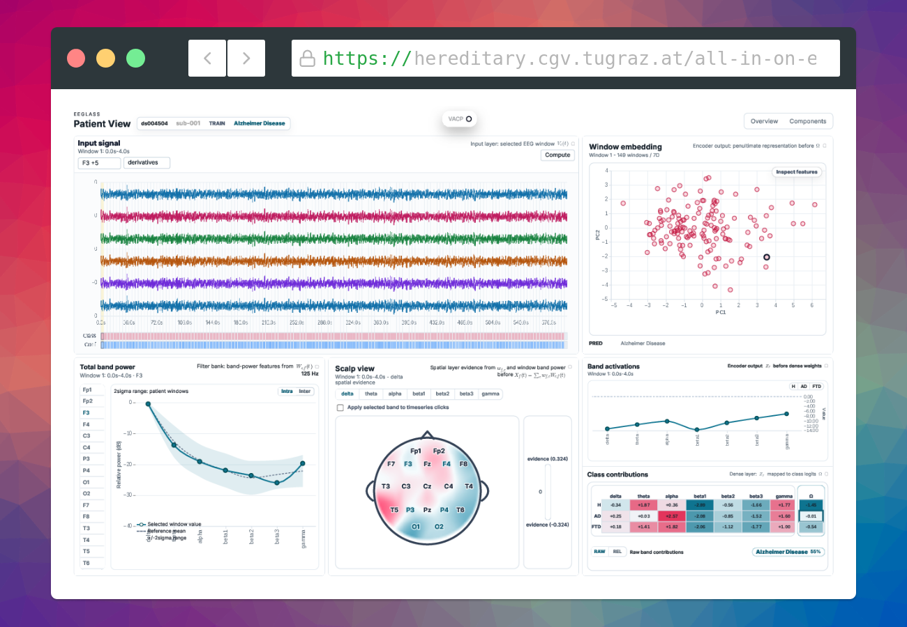

# EEGlas

To make clinical diagnoses more understandable, we present EEGlas, a visual interactive dashboard on top of the efficient xEEGNet classifier network architecture, which puts a special emphasis on explainability of the model and outcome.
This dataset and model focuses on Alzheimer’s Disease (AD) and Frontotemporal Dementia (FTD); every step in the classification is presented in a visual and understandable way, on top of an integrated Electroencephalography (EEG) database viewer.



## Contribute

Combination of all frontend and backend utilities, and baseline for xEEG dashboard development.

To install dependencies:

```bash
uv install
bun install
```

If uv version is newer, use:

```
uv sync
```

To start a development server:

```bash
uv run fastapi dev backend/app.py --reload-dir backend/
bun dev
```

To format code:

```bash
ruff format
prettier -w .
```

Also useful: `ruff check --fix --unsafe-fixes`.

---

### Docker Deployment

Build and start the full stack:

```bash
docker compose up --build
```

The compose setup starts three services:

- `dataset-downloader`: downloads and extracts the configured dataset into the `datasets` Docker volume, then exits.
- `backend`: starts only after `dataset-downloader` completed successfully. It serves the API on <http://localhost:8000>.
- `frontend`: serves the UI on <http://localhost:3000>.

The default dataset is large. `docker-compose.yml` also contains a commented smaller dataset URL (only 5 patients instead of 88) that can be swapped into `DATASET_URL` to test the download flow without downloading the full 4.2 GB dataset.
