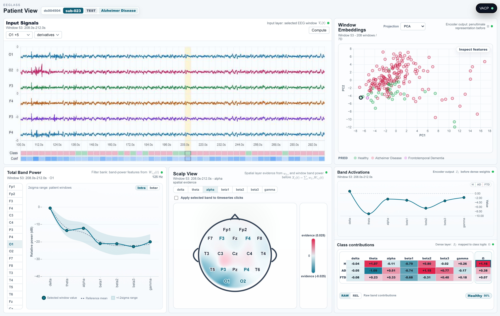

# EEGlass

To make clinical diagnoses more understandable, we present EEGlass, a visual interactive dashboard on top of the efficient xEEGNet classifier network architecture, which puts a special emphasis on explainability of the model and outcome.
This dataset and model focuses on Alzheimer’s Disease (AD) and Frontotemporal Dementia (FTD); every step in the classification is presented in a visual and understandable way, on top of an integrated Electroencephalography (EEG) database viewer.



## The Model

xEEGNet is a fully interpretable classifier with only $F \cdot (C + L + 2) = 168$ trainable parameters.
For a subject $k$: $C = 19$ channels $V_c(t)$, $N = L \cdot f_s = 500$ samples ($L = 4$ s, $f_s = 125$ Hz).

**1. Bandpass filters** ($F = 7$ fixed FIR filters $\delta, \theta, \alpha, \beta_1, \beta_2, \beta_3, \gamma$):

$$W_{c,f}(t) = \mathrm{Filter}_f\left[V_c(t)\right]$$

**2. Spatial mixing** with learned weights $w_{c,f}$:

$$X_f(t) = \sum_{c=1}^{C} w_{c,f} W_{c,f}(t)$$

**3. Batch norm + band power** (square, average, log):

$$\hat{Z}_f = 10 \log_{10}\left(\frac{1}{N_1} \sum_{i=0}^{N_1 - 1} X_f(t_i)^2\right)$$

**4. Linear classifier** ($M \in \mathbb{R}^{L \times F}$, $L = 3$ classes):

$$\mathbf{\Omega} = M \hat{\mathbf{Z}} \in \mathbb{R}^{L}, \qquad \mathbf{y} = \arg\max(\mathbf{\Omega})$$

$M_{l,f} \hat{Z}_f$ gives the signed per-band class contribution shown in the dashboard.

In short: fixed bandpass _filters_ $\rightarrow$ learned spatial _mixing_ $\rightarrow$ _bandpower_ $\rightarrow$ linear _classifier_.
Every intermediate value has a direct physical meaning, so clinicians inspect architecture-intrinsic evidence rather than post-hoc saliency maps.

## Contribute

Combination of all frontend and backend utilities, and baseline for xEEG dashboard development.

To install dependencies:

```bash
uv install
bun install
```

If uv version is newer, use:

```
uv sync
```

To start a development server:

```bash
uv run fastapi dev backend/app.py --reload-dir backend/
bun dev
```

To format code:

```bash
ruff format
prettier -w .
```

Also useful: `ruff check --fix --unsafe-fixes`.

---

### Docker Deployment

Build and start the full stack:

```bash
docker compose up --build
```

The compose setup starts three services:

- `dataset-downloader`: downloads and extracts the configured dataset into the `datasets` Docker volume, then exits.
- `backend`: starts only after `dataset-downloader` completed successfully. It serves the API on <http://localhost:8000>.
- `frontend`: serves the UI on <http://localhost:3000>.

The default dataset is large. `docker-compose.yml` also contains a commented smaller dataset URL (only 5 patients instead of 88) that can be swapped into `DATASET_URL` to test the download flow without downloading the full 4.2 GB dataset.
