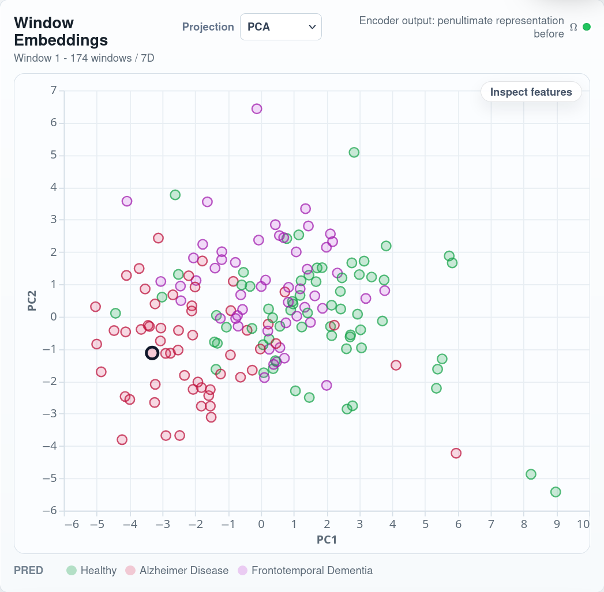
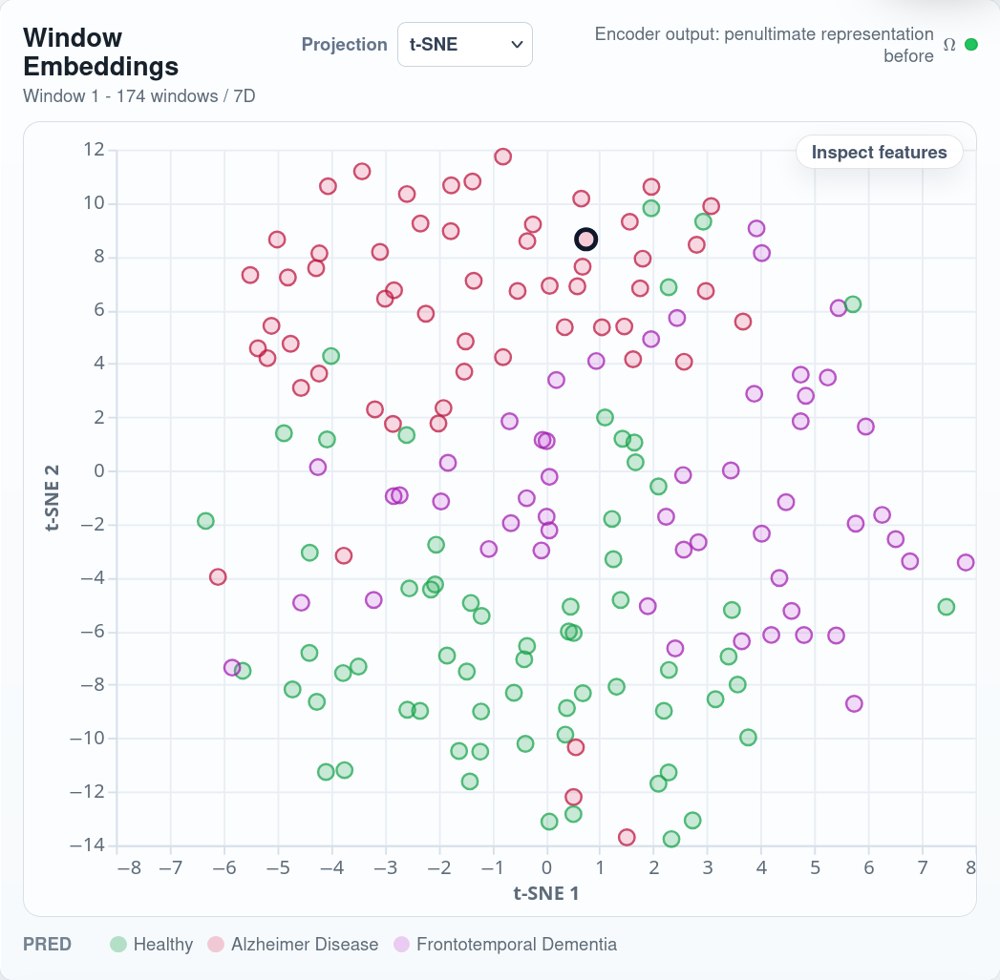
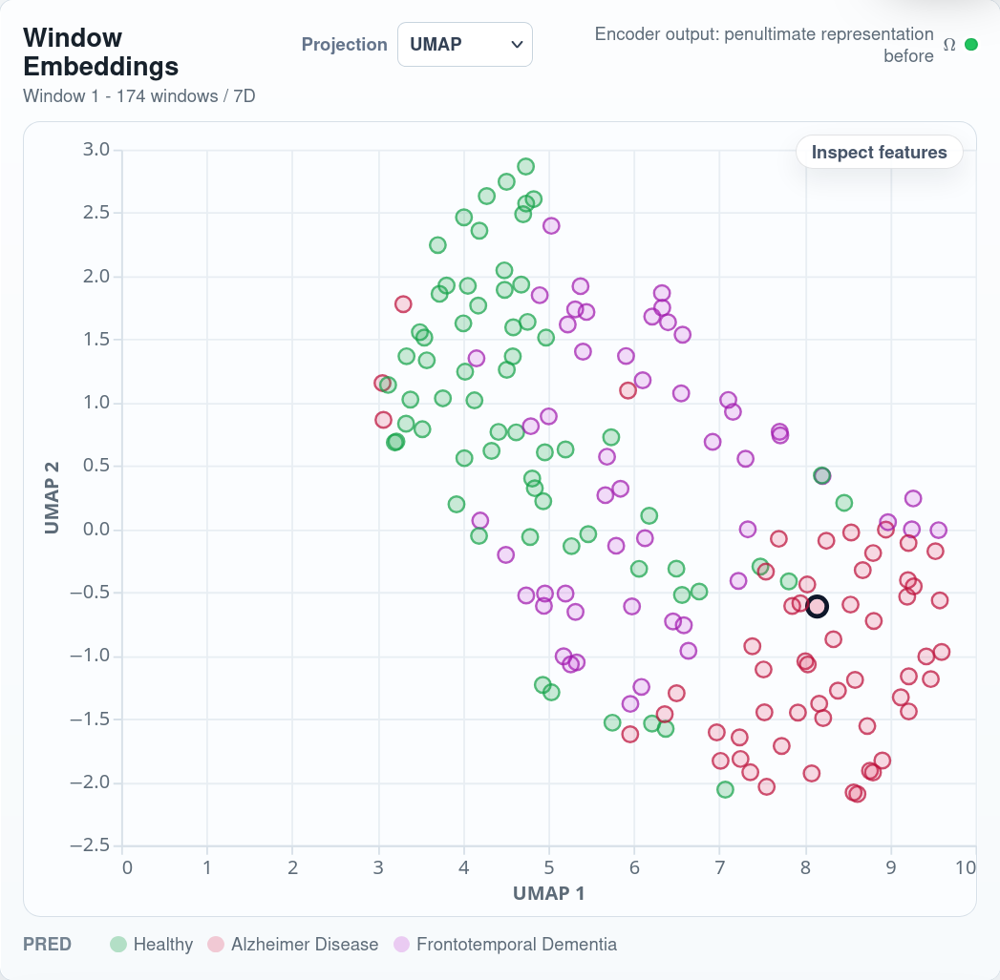

# EEGlass

To make clinical diagnoses more understandable, we present EEGlass, a visual interactive dashboard on top of the efficient xEEGNet classifier network architecture, which puts a special emphasis on explainability of the model and outcome.
This dataset and model focuses on Alzheimer’s Disease (AD) and Frontotemporal Dementia (FTD); every step in the classification is presented in a visual and understandable way, on top of an integrated Electroencephalography (EEG) database viewer.


You can find the full paper [here](https://diglib.eg.org/server/api/core/bitstreams/7d3b2ed3-7011-4cb8-b3cf-5a4a37630f3b/content).

## The Model

xEEGNet is a fully interpretable classifier with only $F \cdot (C + L + 2) = 168$ trainable parameters.
For a subject $k$: $C = 19$ channels $V_c(t)$, $N = L \cdot f_s = 500$ samples ($L = 4$ s, $f_s = 125$ Hz).

**1. Bandpass filters** ($F = 7$ fixed FIR filters $\delta, \theta, \alpha, \beta_1, \beta_2, \beta_3, \gamma$):

$$W_{c,f}(t) = \mathrm{Filter}_f\left[V_c(t)\right]$$

**2. Spatial mixing** with learned weights $w_{c,f}$:

$$X_f(t) = \sum_{c=1}^{C} w_{c,f} W_{c,f}(t)$$

**3. Batch norm + band power** (square, average, log):

$$\hat{Z}_f = 10 \log_{10}\left(\frac{1}{N_1} \sum_{i=0}^{N_1 - 1} X_f(t_i)^2\right)$$

**4. Linear classifier** ($M \in \mathbb{R}^{L \times F}$, $L = 3$ classes):

$$\mathbf{\Omega} = M \hat{\mathbf{Z}} \in \mathbb{R}^{L}, \qquad \mathbf{y} = \arg\max(\mathbf{\Omega})$$

$M_{l,f} \hat{Z}_f$ gives the signed per-band class contribution shown in the dashboard.

In short: fixed bandpass _filters_ $\rightarrow$ learned spatial _mixing_ $\rightarrow$ _bandpower_ $\rightarrow$ linear _classifier_.
Every intermediate value has a direct physical meaning, so clinicians inspect architecture-intrinsic evidence rather than post-hoc saliency maps.

## Node-SCC models

The pretrained-model selector supports the three-class node-SCC checkpoints v200–v204 alongside the five baseline xEEGNet checkpoints. Model metadata controls the available BP/SCC views; the default model remains unchanged.

For SCC models, the classifier receives seven BP activations followed by seven batch-normalized SCC activations. Both branches use the wrapper's outer `Dense` weights, so their class contributions add exactly to the full-model logits. Embeddings and feature exports use the same 14 inputs. The original BP and SCC frequency boundaries are preserved separately and shown in tooltips.

The spatial-weight, dense-weight, patient-scalp, and spectral-measurement panels have independent branch selectors. Band Activations can overlay SCC, and the contribution table's ΣSCC/ΣBP totals isolate each branch while retaining the full prediction. In SCC measurement mode, each electrode shows its mean coherence with the other 18 electrodes. Intra-patient references summarize windows; inter-patient references give each patient equal weight and require a completed **Compute all** job.

Raw connectivity is shared across checkpoints through the SCC cache. Predictions, normalized features, and learned contributions remain checkpoint-specific. SCC-derived prediction signatures include the transform identity and feature-layout version; baseline cache signatures are preserved. Dashboard inference imports the local model implementation without training utilities.

Run the SCC integration checks from the repository root:

```bash
uv run python -m unittest discover -s backend/tests -v
bunx tsc --noEmit
bun run build
```

The backend checks cover strict checkpoint loading, forward-pass parity, logit and node-contribution decompositions, real coherence computation, concurrent cache reuse, reference weighting, failures, model switching, and named exports.

## Supported Dimensionality Reductions

  
PCA, t-SNE and UMAP projections, selectable in all embedding views (PCA is the default).

## Example Use-Case

As an example workflow, a user can start with a new participant by selecting a typical point in the window embedding (R2) to see the predicted output. The Total Band Power panel immediately shows how typical this window's band powers are for the patient, and whether the (e.g. alpha) bands align more with the healthy or AD/FTD cohort (R3). The Scalp View and Band Activations panel make explicit which channels and bands drove the prediction (R1).

Inspecting the raw signal, the user can judge for themselves whether the window looks atypical, where, for each patient and time window individually, the topomap, band activations, and total band power panel indicate which channels and bandpowers are worth a closer look (the corresponding bandpass filter can also be applied to the time-series view), directing the user to the most interesting aspects and making comparison easy while keeping them in control.

## Contribute

Combination of all frontend and backend utilities, and baseline for xEEG dashboard development.

To install dependencies:

```bash
uv install
bun install
```

If uv version is newer, use:

```
uv sync
```

To start a development server:

```bash
uv run fastapi dev backend/app.py --reload-dir backend/
bun dev
```

To format code:

```bash
ruff format
prettier -w .
```

Also useful: `ruff check --fix --unsafe-fixes`.

---

### Docker Deployment

Build and start the full stack:

```bash
docker compose up --build
```

The compose setup starts three services:

- `dataset-downloader`: downloads and extracts the configured dataset into the `datasets` Docker volume, then exits.
- `backend`: starts only after `dataset-downloader` completed successfully. It serves the API on <http://localhost:8000>.
- `frontend`: serves the UI on <http://localhost:3000>.

The default dataset is large. `docker-compose.yml` also contains a commented smaller dataset URL (only 5 patients instead of 88) that can be swapped into `DATASET_URL` to test the download flow without downloading the full 4.2 GB dataset.

# Citation

If you find EEGlass useful or relevant to your work, please feel free to cite it as follows:

```bibtex
@inproceedings{2026-eeglass,
	booktitle = {VCBM 2026 - Eurographics Workshop on Visual Computing for Biology and Medicine - Short Papers},
	editor    = {Krueger, Robert and Mörth, Eric and Furmanová, Katarina},
	title     = {{EEGlass: A Fully Interpretable EEG Dementia Screening Assistant}},
	author    = {Waldert, Peter and Grabner, Michael and Schilcher, Lukas and Tscheppe, Niklas and Tussardi, Gaia and Kantz, Benedikt and Lengauer, Stefan and Schreck, Tobias},
	year      = {2026},
	publisher = {The Eurographics Association},
	issn      = {2070-5786},
	isbn      = {978-3-03868-324-7},
	doi       = {10.2312/vcbm.20261002}
}
```
