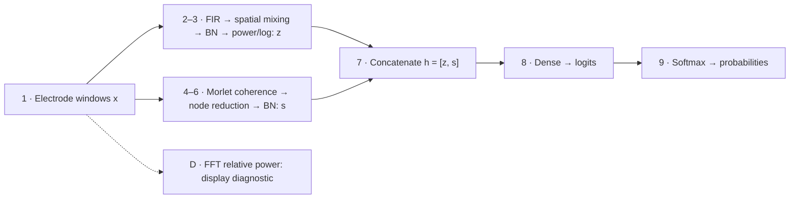

# EEGlass: values from electrodes to softmax

Applies to the three-class **node-SCC v200–v204** models. `B` = windows, `P` = patients; each window has **19 electrodes × 500 samples** (4 s at 125 Hz). Shapes below include `B` unless stated otherwise; patient panels select one window.

## 1. Model information flow

| Point | Value and shape | Origin / transformations | Domain |
|---|---|---|---|
| **1** | `x`: `(B,19,500)` | Derivative EEG; select/order model channels, resample to 125 Hz, convert V → µV, split into non-overlapping windows; discard incomplete tail. | **Time**, electrode amplitudes. |
| **2** | Filtered signals: `(B,7,19,376)`; mixed/normalized `u`: `(B,7,1,376)` | `encoder.conv1`: seven fixed 125-tap FIR filters, valid convolution (`500−125+1=376`). `encoder.conv2`: learned spatial weights `A=(7,19)` sum electrodes within each band; then `batch1`. SCC checkpoints use `base.encoder`. | **Time**, now band-limited and then spatially mixed. Filtering alone does not produce frequency-domain coefficients. |
| **3** | BP features `z`: `(B,7)` | Square `u`, average over time, clamp to `[1e−7,1e4]`, apply `10 log10`, flatten. | **Band-feature space**: log-power of normalized spatial signals; no time axis. These are the BP activation values in dB, not per-electrode absolute power. |
| **4** | Cached coherence pairs: `(B,7,171)`; reconstructed `M`: `(B,7,19,19)` | Same `x` → Morlet time–frequency analysis (`1…45 Hz`, 1-Hz steps, `n_cycles=f/2`) → MNE `coh`, time-aggregated and averaged within SCC bands. Store 171 unique electrode pairs; reconstruct symmetric `M` with diagonal **zero**. | **Spectral connectivity**, dimensionless coherence `[0,1]`; frequency-band labels remain, time samples do not. |
| **5** | Electrode terms `q`: `(B,7,19)`; reduced SCC `r`: `(B,7)` | Learned `reducer.w`, `w=(7,19)`: `q_i = w_i (Mw)_i`; `r = Σ_i q_i = wᵀMw`. | **Learned connectivity features**; signed, not bounded to `[0,1]`. |
| **6** | Normalized SCC `s`: `(B,7)` | `scc_norm(r)` applies learned affine batch normalization. | **Classifier-feature space**; signed normalized SCC, not coherence or dB. |
| **7** | `h=[z,s]`: `(B,14)` | Seven BP features followed by seven normalized SCC features, both in the band order below. | **Classifier-feature space**. |
| **8** | Logits `ℓ`: `(B,3)` | Outer `Dense.weight`, `W=(3,14)`, with **no bias**: `ℓ = h Wᵀ`. The retained `base.Dense` is unused. | **Class-score space**, unbounded logits. |
| **9** | Probabilities `p`: `(B,3)` | `softmax(ℓ)` across H / AD / FTD. Prediction = `argmax(p)`; window confidence = `max(p)`. | **Probability space**. |

Inference uses evaluation mode and disabled gradients: both batch-normalization layers use saved training statistics, and dropout is inactive. Baseline models follow points **1–3 → 8–9**, with seven classifier inputs and `W=(3,7)`.

**Diagnostic D:** independently of the neural encoder, `x` → demean → Hann taper → real FFT `(B,19,251)` → squared-magnitude PSD → trapezoidal band integration. Divide each band's power by the electrode's 0.5–45 Hz power to obtain `R=(B,19,7)`. This is a frequency-derived power summary, not an additional inference input.

## 2. Component mapping

| Component | Values actually displayed / connection to the flow |
|---|---|
| **Input Signals** | Time-domain electrode traces (point **1** context). The viewer can show raw or derivative recordings; inference always uses derivative windows. Optional BP-band filtering changes displayed waveforms only. |
| **Overview · Spatial Weights** | **BP:** `A=(7,19)` from point **2**. **SCC:** `w=(7,19)` from point **5**. Select one band → 19 learned, class-independent weights. |
| **Overview · Dense weights** | Point **8**: `W_BP=W[:,:7]` or `W_SCC=W[:,7:]`, each `(3,7)`. These are classifier parameters, not patient activations. |
| **Patient · Band Activations** | Points **3/6**: seven `z` values (left dB axis), optionally seven `s` values (right normalized-SCC axis). Selecting class `c` displays `z_b W_BP[c,b]` and `s_b W_SCC[c,b]` on one logit-contribution axis. |
| **Patient · Class Contributions** | Before the sum at point **8**: `K_BP=z×W_BP`, `K_SCC=s×W_SCC`, each `(B,3,7)`. Band cells show their sum or an isolated branch. ΣSCC / ΣBP are raw sums over bands; together they reconstruct each logit. Full logits, prediction and confidence remain unchanged by branch isolation. |
| **Patient · Scalp View — BP** | **D + point 2:** `A × transpose(R)` → `(B,7,19)`. A weighted relative-power **proxy**; its electrode sum does **not** reconstruct the BP activation or class logit. |
| **Patient · Scalp View — SCC** | Point **5**: `q=(B,7,19)`. Electrode values sum **exactly to `r`, before SCC batch normalization**; they are not class contributions. |
| **Patient · Total Band Power** | **D:** selected electrode's seven values `10 log10(max(R,1e−6))`, in dB relative to its total band power. |
| **Patient · Mean Spectral Connectivity** | Point **4**, before learned weighting: `m_i=Σ_{j≠i} M_ij/18` → `(B,7,19)`. Selected electrode → seven mean-coherence values, fixed `[0,1]` axis. |
| **Embeddings / raw features / exports** | Point **7**: window vectors `(B,14)`; patient vectors `(P,14)` are means across each patient's windows. PCA / t-SNE / UMAP produce 2D **feature-space** coordinates, not scalp positions or frequencies. PCA centers features; no extra branch-wise standardization is added. Names identify BP/SCC and band. |
| **Embedding feature importance** | Same point-**7** inputs; existing XGBoost surrogate + mean absolute SHAP values for the selected label target. This is separate from the exact Dense contributions above. |

## 3. Display transformations and band definitions

- **Topomaps:** select 19 electrode values and interpolate onto a scalp grid. The grid is a display surface; sum the electrode values, not interpolated pixels. Signed maps use symmetric diverging ranges.
- **Relative contribution mode:** subtract each displayed band's mean across the three classes. Branch totals and logits stay raw; tooltips retain raw band contributions.
- **SCC reference shading:** intra = mean ±2 population standard deviations across patient windows; inter = the same across **patient means**, with equal patient weight and optional true-label cohort. Inter requires completed “Compute all”. Shading is clipped to `[0,1]`; tooltip bounds remain unclipped.

| Branch · Hz | delta | theta | alpha | beta1 | beta2 | beta3 | gamma |
|---|---|---|---|---|---|---|---|
| BP | 0.5–4 | 4–8 | 8–12 | 12–16 | 16–20 | 20–28 | 28–45 |
| SCC | 0.5–4 | 4–8 | 8–13 | 13–17 | 17–21 | 21–25 | 25–45 |

Combined contributions sum corresponding **named features**, not identical frequency intervals. Waveform filters always use BP limits.

Code anchors: [preprocessing](backend/ml/data_utils/load_data.py), [BP encoder](backend/ml/model.py), [coherence and node reducer](backend/ml/scc_cache.py), [runtime / evidence / FFT diagnostics](backend/services/model_service.py), [SCC statistics](backend/services/scc_service.py), [projections](backend/services/embedding_service.py), [feature importance](backend/services/feature_importance_service.py).
